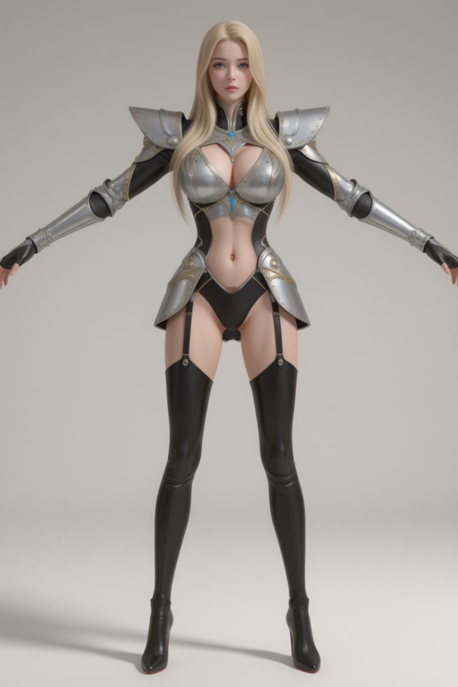

# Character Assets

## Human

- https://sketchfab.com/3d-models/blake-slim-walk-c4d-c076264ca7394357bf3f17837edd72c9 — **[미사용]** 캐릭터 미사용; 걷기 애니는 Mixamo 사용
- https://sketchfab.com/3d-models/xbot-049e4a44ad8b449dba8a2c4824502f5c — **[미사용]** 사용한 적 없음
- "Beauty Girl Exercising - Undressed Workout" (https://skfb.ly/pxpoo) by Polygonal Studios is licensed under Creative Commons Attribution (http://creativecommons.org/licenses/by/4.0/). — **[미사용]** Mixamo 도입 후 삭제
- "Beautiful Realistic Undressed Girls - 14 Anims" (https://skfb.ly/pxpoH) by Polygonal Studios is licensed under Creative Commons Attribution (http://creativecommons.org/licenses/by/4.0/). — **[미사용]** 초기 테스트용, Mixamo 도입 후 삭제
- "Mutant Mixamo" (https://skfb.ly/6DvxK) by NAZTart is licensed under Creative Commons Attribution (http://creativecommons.org/licenses/by/4.0/). — **[미사용]** Mixamo 도입 후 삭제
- "MIXAMO" (https://skfb.ly/ottKO) by sdhkim is licensed under Creative Commons Attribution (http://creativecommons.org/licenses/by/4.0/). — **[미사용]** Mixamo 사이트 알기 전 Sketchfab에서 찾은 애니, Mixamo 도입 후 미사용
- "Bandit Armor and Clothes - Game Model" (https://skfb.ly/6UVot) by wolkoed is licensed under Creative Commons Attribution (http://creativecommons.org/licenses/by/4.0/). — **[미사용]**
- Maria https://sketchfab.com/3d-models/maria-a04cac95ab8046e4bbdc9dec30c7d92d — **[미사용]** 초기 사용, 현재 미사용
- dying https://sketchfab.com/3d-models/dying-98a1d5b2288d49d993039cb161913cd3 — **[미사용]** 정적 dead 포즈 모델(CC-BY, robotgoul); 인게임 death 애니와 다름을 확인 → 캐릭터·애니 소스 아님 (death 클립은 Mixamo 계열)
- medieval_knight https://sketchfab.com/3d-models/medieval-knight-sculpture-game-ready-6cdd055b4afa41eb9360dbbfe75c7f10 — **[미사용]**

## Female Knight

- (초기) ComfyUI에서 jibMixZIT_v10.safetensors로 원화 생성 
- 현재 원화  (그리기: ComfyUI jibMixZIT_v10, A포즈 변경만 Qwen Image Edit)
- Tripo(유료 등급)에서 3d 모델로 변환 -> 10k 모델로 리매쉬
- mixamo.com에서 리깅 및 애니메이션 부착
- blender에서 스케일/위치 조정(rest pose 원점 발 밑에 오게) -> 매터리얼 조정 (Shader Editor에서 Alpha 끊기) -> .glb 내보내기
- tools/glb-editor에서 `본 이름 표준화`

## Thief → Rogue

`female_thief.glb`가 `female_rogue.glb`로 개명됨 (클래스 Thief → Rogue, 커밋 7eebc39). 현재 사용 중.

- female_knight와 같은 workflow (3D 생성은 meshy.ai)
- 원화  (캐릭터 선택 UI 원화; 초기 thief 원화 `../images/thief-concept.png`에서 교체)

## Knight

- female_knight와 같은 workflow (3D 생성은 meshy.ai)
- 원화 
- nano banana2로 A 포즈 
- character_concepts 원화 `character_concepts/knight.png` (Gemini)

## Other Classes

아래 플레이어 클래스는 female_knight와 같은 AI 워크플로우 (ComfyUI 원화 → Nano Banana/Grok 포즈 → 3D 생성 → Mixamo 리깅). 3D 도구는 캐릭터별로 다름(Meshy/Tripo) — License 섹션의 3D 도구 매핑 참조.

- barbarian / female_barbarian — Warrior 대체; 원화: barbarian(남) `character_concepts/barbarian.png` (Gemini), female_barbarian `character_concepts/female_barbarian.png`
- caveman / cavewoman — 원화: caveman(남) `character_concepts/caveman.png` (Qwen Image Edit), cavewoman `character_concepts/cavewoman.png`
- priest / female_priest — 원화: priest(남) `character_concepts/priest.png` (Gemini), female_priest `character_concepts/female_priest.png`
- ranger — 남성 ranger; 원화 `character_concepts/ranger.png` (Gemini)
- valkyrie — 단일 성별; 원화 `character_concepts/valkyrie.jpg`
- rogue (남) — 남성 rogue 모델; 원화 `character_concepts/rogue.png` (Gemini/Nano Banana); female_rogue는 [Thief → Rogue](#thief--rogue) 참고

## NPC Models

플레이어 클래스 아님.

- guard — 경비병 NPC Karl (`guard.glb`, CharacterClass::Guard); 원화 `../images/karl-concept.png`, 3D는 Meshy.ai (라이센스는 위 License 표 참조)
- npc_woman — 상인 NPC Rica (`npc_woman.glb`); 원화 `../images/rica-concept.png` (Gemini) (커밋 fb299e7)

## License (AI 제작 캐릭터)

위 AI 워크플로우로 만든 플레이어 캐릭터 전부(knight, barbarian, caveman, priest, rogue, ranger, valkyrie의 male/female)의 도구별 라이센스. 3D 도구는 female_knight만 Tripo, 그 외 전부 Meshy. (조사 2026-07, 약관 변경 가능)

| 단계 | 도구 | 라이센스 | 비고 |
|------|------|---------|------|
| 원화 | ComfyUI + jibMixZIT / Z-Image Turbo / Qwen Image Edit | Apache 2.0 | 상업 OK, 표시 의무 없음 (로컬 실행) |
| T/A 포즈 | Nano Banana(Gemini) / Grok | 출력물 사용자 소유, 상업 OK | 전 등급 동일, IP 배상 없음 |
| 3D 메쉬 (대부분) | Meshy.ai (유료 생성) | 완전 소유권, 상업 OK | 무료 다운그레이드해도 유지 (CC-BY 전환 안 됨) |
| 3D 메쉬 (female_knight) | Tripo (유료 Pro+ 생성) | 유료=완전 상업권 | ⚠️ 다운그레이드 후 유지 여부 약관 미명시 — 인보이스 보관·support 문의 |
| 리깅/애니 | Mixamo (Adobe) | 무료·로열티 없음·상업 OK | 원본 파일 단독 재배포 금지, 임베드는 OK |

핵심 조건:

- Meshy: 유료 때 생성분은 상업권 영구 유지. 단 ① Meshy Community에 공개 게시 안 함, ② 입력물이 타 저작권 미침해(위 원화·포즈 체인은 Apache 2.0/사용자 소유라 충족).
- Tripo: 유료 생성 시점엔 완전 상업권이나 **다운그레이드 후 유지 여부가 약관에 없음** (Meshy보다 리스크). 상업화 전 support@tripo3d.ai 확인 권장.
- **3D 도구 매핑** (Tripo=리스크, Meshy=안전): Tripo = female_knight (유일) / Meshy = 그 외 캐릭터·NPC 전부.
- 입증 대비: **Meshy·Tripo 결제 인보이스 + 생성 날짜** 보관 (유료 시점 생성 증빙).
- AI 생성 이미지는 저작권 보호가 약해 독점권 주장은 어려움(사용은 무방).

출처: [Meshy 취소 시 라이센스](https://help.meshy.ai/en/articles/9992023-if-i-cancel-my-subscription-will-all-my-models-revert-to-a-cc-by-4-0-license), [Tripo 약관](https://www.tripo3d.ai/terms), [Tripo 라이센스 가이드](https://www.tripo3d.ai/game-development/3d-assets-license-game-development), [Mixamo FAQ](https://helpx.adobe.com/creative-cloud/faq/mixamo-faq.html), [jibMixZIT](https://civitai.com/models/2231351/jib-mix-zit), [Z-Image Turbo](https://huggingface.co/Tongyi-MAI/Z-Image-Turbo)
