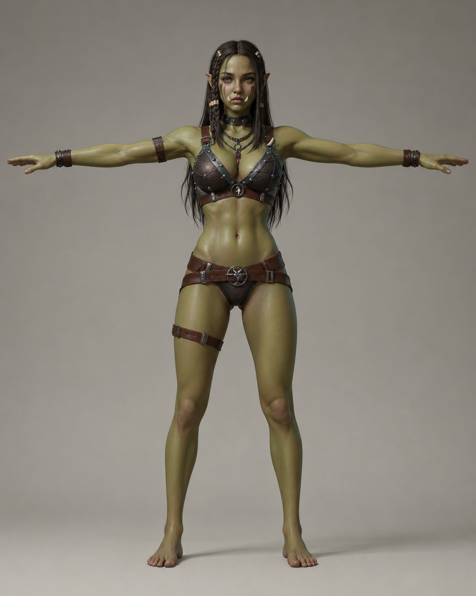

# Monster Assets

## Monster

- SCP939 https://sketchfab.com/3d-models/scp939-79a749a5073b453d9d85875797bf45d7
- Orc https://create.verse8.io/ 에서 2d -> 3d 생성함
  - 원화는 chatgpt.com에서 다음 프롬프트로 생성함

    > T-pose, fantasy concept art of an orc warrior, muscular humanoid with greyish-green leathery skin, protruding lower tusks, heavy brow ridge, pointed ears, battle-scarred face, crude iron and bone armor, tribal war paint, dramatic rim lighting, dark earthy color palette, detailed character design sheet, painterly digital art, D&D fantasy aesthetic, highly detailed, 4k

    > change it to simple background, character only, no texts

    > make the background light grey

    > make his skin more green

    
- female orc https://create.verse8.io/ 에서 2d -> 3d 생성함; 원화는 chatgpt.com에서 생성 
- goblin https://create.verse8.io/ 에서 2d -> 3d 생성함; 원화는 chatgpt.com에서 생성 
- kobold https://create.verse8.io/ 에서 2d -> 3d 생성함
  - 원화는 chatgpt.com에서 다음 프롬프트로 생성함
    > d&d 혹은 nethack에 나오는 kobold를 3d로 제작할 수 있게 T자형 포즈로 그려줘
