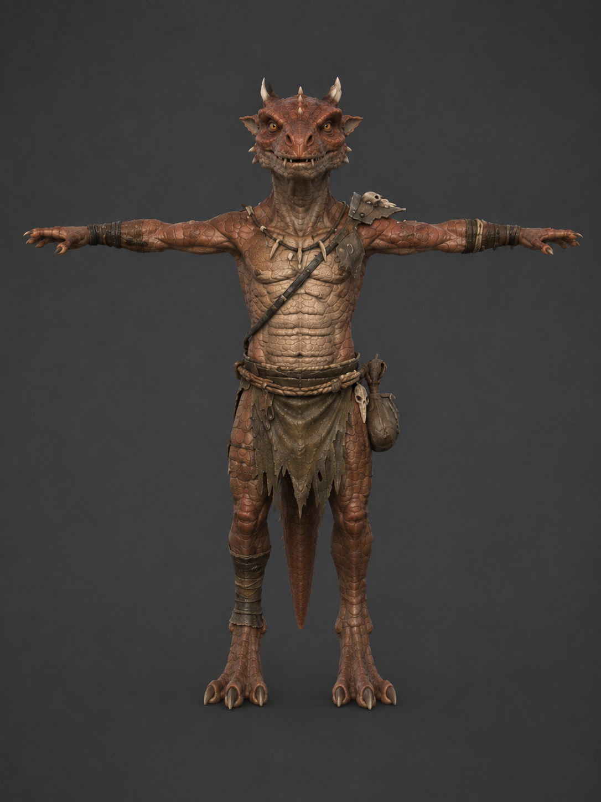
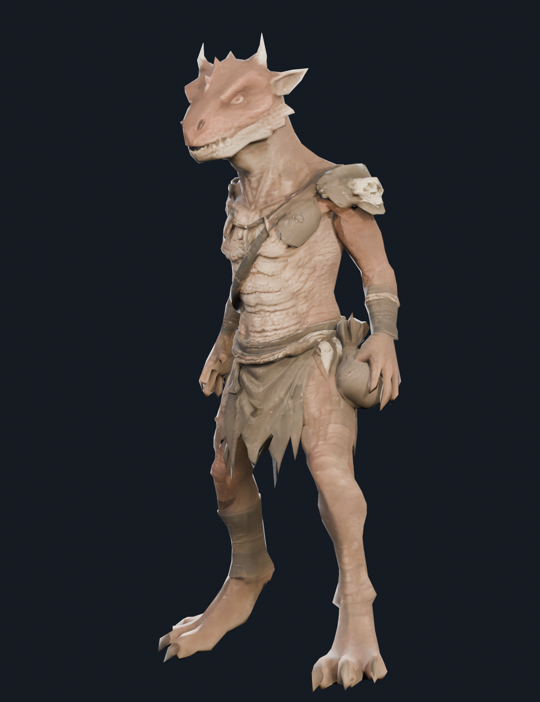
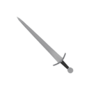

# Devlog - 2026-06-08

## Kobold

- Added the kobold as a new monster.
- Generated kobold concept art with ChatGPT, then used that image as the input for a 2D -> 3D workflow on create.verse8.io.
- Asked Claude to adjust the model scale in Blender, setting the kobold to 0.9m tall because kobolds are small creatures in D&D-inspired fantasy settings.
- Added the generated 3D model to the project as `client/public/models/monsters/kobold.glb`.

### Gameplay Details

- Level: 1.
- Behavior: timid, so it uses the fleeing monster behavior.
- Weapon: `small_sword`.
- Weapon drop chance: 25%.

### Concept Art

### 3D Model

## Small Sword

- Added `small_sword` as the kobold's weapon.
- It is a compact crude blade sized for small fighters.
- The model was sourced from Sketchfab: https://sketchfab.com/3d-models/low-poly-sword-49ac822d1a734abb8c41f8217afc688b

### Icon

- The icon was created from a Blender screenshot of the model.

### Gameplay Details

- Equip slot: main hand.
- Damage: 1d4.
- Weight: 1.5.
- Material: metal.
- World model: `small_sword.glb`.
